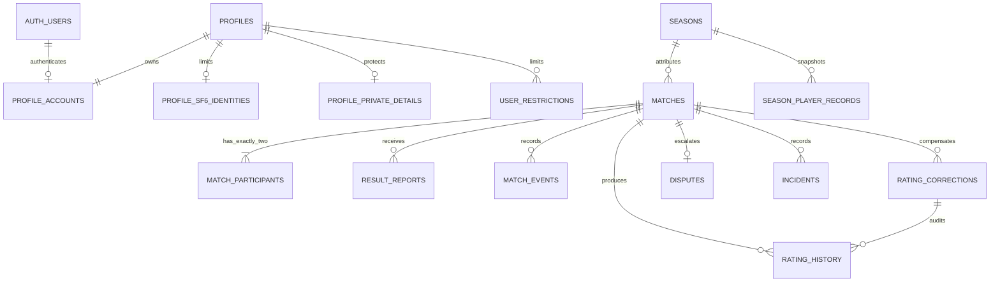

# Phase 1 — Data Foundation Contract

Status: Complete
Scope: Phase 1 only  
Source of Truth: `docs/implementation-plan.md` and `docs/tasks.md`, interpreted through reviewed Feature Specs and `docs/architecture.md`

## Outcome

Phase 1 establishes the minimum database contract needed by later vertical slices. It does not implement Auth UI, Onboarding, Matchmaking, Match Room, Result Reporting, Rating calculation, Season rollover, or Admin UI behaviour.

Normal browser roles have read access only to explicitly allowed rows and projections. Competitive and moderation writes remain reserved for future trusted RPC/domain actions. This prevents Phase 1 from exposing partially implemented direct-write workflows.

## Canonical model



The canonical Match fields are:

- `status`: `matched | room_setup | reporting | disputed | completed | cancelled`
- `resolution_type`: separate from lifecycle status
- `result_validity`: `valid | invalidated` only for result-bearing completed Matches
- `rating_status`: `not_applicable | pending | applied | correction_pending | corrected`

`completed` requires a formal winner and loser. `cancelled` rejects winner, score, result validity, and Rating application. A normal result accepts only normalized FT3 scores 3–0, 3–1, or 3–2. Forfeit deliberately has no fabricated final score.

## Data ownership and visibility

| Data | Owner / writer | Browser visibility | Owning future phase |
| --- | --- | --- | --- |
| `profiles` public fields | Trusted Profile action | Public only when `is_public` and not deleted | Phase 2 / 6 |
| `profile_accounts` | Trusted Account action | Self, Admin | Phase 2 |
| `profile_sf6_identities` | Trusted Profile action | Self, current active opponent, Admin | Phase 2 / 4 |
| `profile_private_details` | Trusted Profile action | Self, Admin | Phase 2 |
| `placement_initializations` | Trusted Onboarding action | Self, Admin | Phase 2 / 5 |
| `seasons`, Rating parameter sets | Migration / trusted Season action | Readable; no client writes | Phase 5 / 7 |
| `season_player_records` | Rating / rollover transaction | Public records for public profiles; self/Admin otherwise | Phase 5 / 7 |
| `waiting_entries`, cooldowns | Trusted Matchmaking action | Self/involved pair, Admin; no public raw pool | Phase 3 |
| `matches`, participants, events | Trusted Match action | Participants, Admin | Phase 3 / 4 |
| `result_reports`, revisions | Trusted Reporting action | Reporter only before finalization; Admin | Phase 5 |
| `rating_history`, corrections | Rating/Admin transaction | Self, Admin | Phase 5 / 8 |
| `incidents`, disputes, restrictions, audit | Trusted moderation actions | Reporter or affected self where specified; Admin | Phase 8 |
| `private.domain_action_receipts` | Same transaction as trusted action | No browser access | All mutation phases |

`public_profiles` structurally excludes Auth mapping, detailed region, character information, SF6 identity, moderation, and pending Match data. `active_match_private_profiles` is a security-invoker view and preserves the underlying participant and limited-identity RLS checks.

## Integrity foundations

- One active Season is enforced by a partial unique index. Every Season is exactly three calendar months.
- One active Waiting Entry and one active Match participation per Profile are enforced by partial unique indexes.
- Every Match must have exactly one `player_a` and one `player_b`; deferred constraints support atomic Match + participant creation.
- Match attribution, Rated flag, creation source, and Rating parameter snapshot are immutable.
- Only canonical lifecycle transitions are accepted. Terminal results cannot be reopened or rewritten.
- Terminal Match transition clears both participant active gates in the same transaction.
- Rating History permits one normal result entry per Match and Player, one reset per Season and Player, and one history entry per compensating correction; it is append-only.
- Placement count cannot decrease, and completed Placement cannot return to an active state even after Match invalidation.
- Finalized Season records and their completed-Season membership, result-report revisions, Match events, Rating History, and Admin audit logs are immutable. Season record insertion locks the parent against a concurrent completion race.
- Rating and starting-Rating parameters are versioned; old values cannot be edited or deleted.
- Rated pair cooldown rows use canonical UUID order and exactly 24 hours from confirmed result time.
- Confirmed reliability incidents are unique per Match and responsible Profile.
- Match invalidation corrections are unique per source Match, Profile, and correction type.

## Transaction boundaries for later phases

Phase 1 provides guards and receipts, not feature workflows. Later trusted actions must use these boundaries:

1. Match creation: lock/revalidate eligibility and canonical pair, create one Match with exactly two participants, clear relevant Waiting Entries, and commit once.
2. Result finalization: lock Match/reports/profiles, compare normalized reports, write both Rating History rows, update both current Ratings and active Season records, finalize Match, and commit once.
3. Placement tenth result: include Rating, progress `10/10`, completion, and ranking eligibility in the result-finalization transaction.
4. Season rollover: explicitly defer `season_player_records_require_matching_season_state` and `seasons_require_finalized_player_records`, close pending Rated Matches, finalize immutable snapshots, complete the old Season, and apply each eligible Profile reset exactly once before setting the constraints immediate and committing.
5. Completed Match invalidation: invalidate source result, create compensating corrections, update current Rating/current Season stats, and append Admin audit in one idempotent transaction. Never change completed-Season snapshots or Placement count.

`private.claim_domain_action` reserves `(scope, idempotency key, actor)` and rejects reuse with a different request hash. It must be called in the same PostgreSQL transaction as the mutation. Unique constraints remain the final concurrency guard. `npm run db:test` also opens two real PostgreSQL sessions against the local Supabase container and verifies that simultaneous identical claims produce exactly one owner and one retry.

## Permission matrix

| Boundary | Guest | Authenticated / non-owner | Owner or participant | Admin | Service role |
| --- | --- | --- | --- | --- | --- |
| Public Profile / Season data | Read | Read | Read | Read | Full |
| Account / private Profile | Deny | Deny | Read self | Read | Full |
| Active opponent SF6 identity | Deny | Deny | Read during active Match | Read | Full |
| Match / participant / event | Deny | Deny | Read involved Match | Read | Full |
| Result report content | Deny | Deny | Read own report only | Read both | Full |
| Rating history / correction | Deny | Deny | Read self | Read | Full |
| Dispute / audit internals | Deny | Deny | Deny | Read | Full |
| Direct table writes | Deny | Deny | Deny | Deny | Trusted transaction only |

Admin detection currently uses `profile_accounts.application_role` behind a security-definer helper. Phase 8 must define the human bootstrap and operational authorization procedure before any Admin UI or Admin RPC is enabled.

## Migration order

1. `20260815000100_phase1_domain_types.sql` — stable enums and private schema.
2. `20260815000200_phase1_core_schema.sql` — tables, foreign keys, checks, indexes, and versioned parameter baseline.
3. `20260815000300_phase1_integrity_and_transactions.sql` — lifecycle/state guards, immutable records, participant gate synchronization, and idempotency receipt primitives.
4. `20260815000400_phase1_rls_and_api_boundaries.sql` — RLS, grants, helper authorization functions, projections, and service-only health check.
5. `supabase/seed.sql` — local/test active Season only.

Migrations are forward-only. Production dates/names are not sourced from the local seed. Apply to shared or production projects only after local reset/test/lint, backup/readiness review, and explicit human approval.

## Generated types workflow

```sh
npm run db:start
npm run db:reset
npm run db:test
npm run db:lint
npm run db:types
git diff --exit-code -- src/lib/supabase/database.types.ts
```

The generated `Database` type is passed to browser, server, and proxy Supabase clients. Feature repositories in later phases should depend on aliases from `src/lib/database/types.ts` rather than handwritten row types.

## Deferred decisions / open questions

The Phase 2 decisions previously deferred by this contract were resolved in `docs/phase-2-account-onboarding-decisions.md`: Username and SF6 User Code normalization, immutable Public User ID, country/broad-region master baseline, Avatar limits, Auth source of truth, account deletion, Master MR validation, onboarding persistence, and public/private identity fields. Phase 2 must implement them through forward migrations and trusted actions without rewriting the Phase 1 migrations.

The following later-phase decisions remain deferred:

- Nearby-country grouping and waiting-time region behavior (Phase 3).
- Production Season start/end/name and rollover operations (Phase 7).
- Candidate weights, heartbeat, rate limits, event retention, and history page sizes.
- Admin bootstrap, queue SLA, fourth-strike duration, and existing-Match handling when a restriction is applied (Phase 8).
- Optional forfeit termination score and Unrated public statistics.

There is no remaining Phase 2 Product Decision blocker in this Phase 1 contract.
